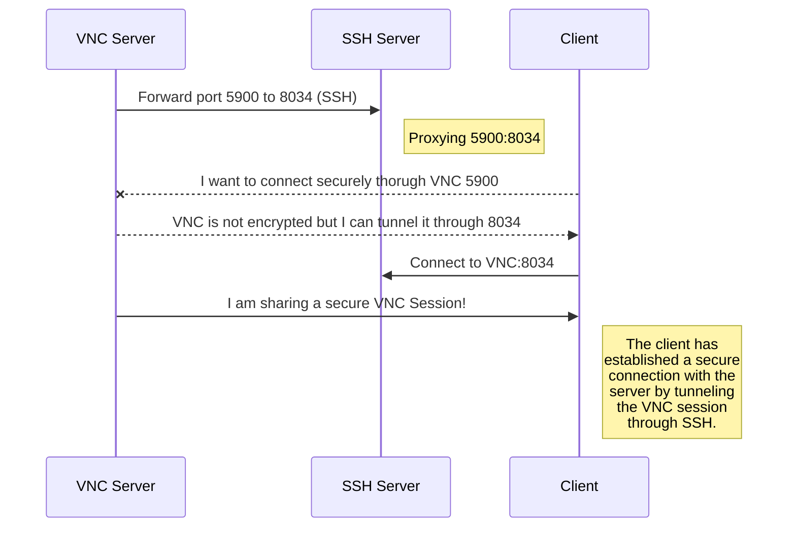
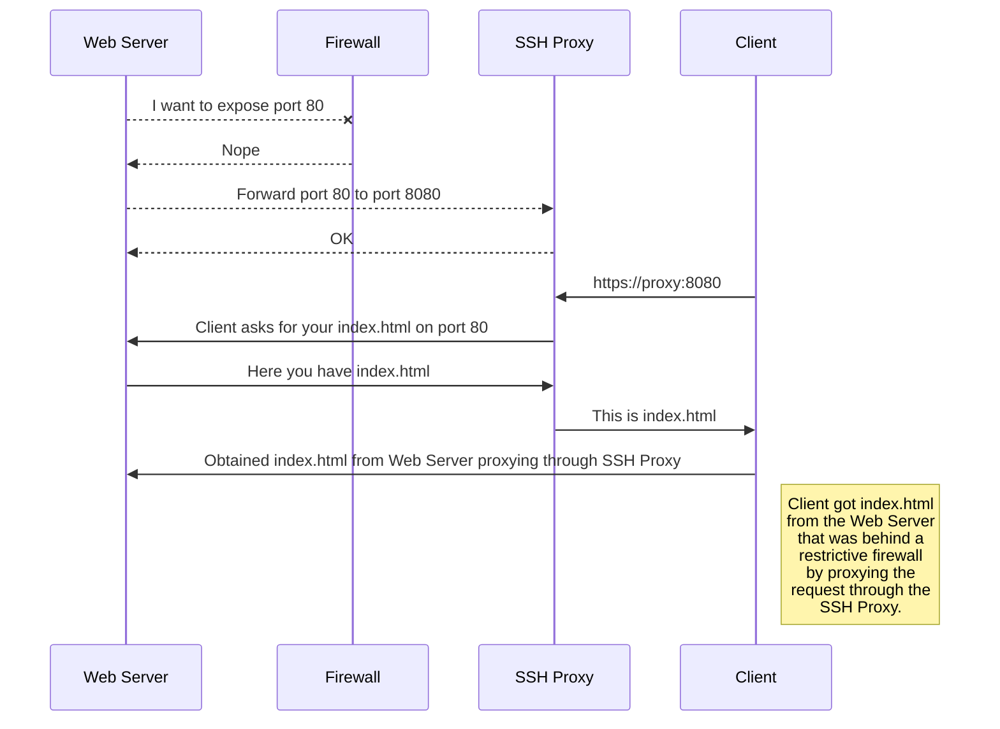

#  SSH Tunnel Manager 

Tunnel Manager is a tool for **proxying, pivoting and securing connections over SSH.**
It's basically a GUI wrapper for **plink** but adds **profiling, notifications** and is focused on **automation** and **session persistence**.
It is written mainly in **[AutoHotkey](https://www.autohotkey.com/)** and the GUI framework that I used is [Neutron.ahk](https://github.com/G33kDude/Neutron.ahk), so it has a little bit of HTML, CSS (Bootstrap 3), JS and JQuery.

I created a thread on the **[AutoHotkey Forums](https://www.autohotkey.com/boards/viewtopic.php?t=125013)** for discussion about Tunnel Manager, but I also read questions and suggestions on the **[AutoHotkey Discord](https://discord.com/invite/Aat7KHmG7v)**.

> **Pro Tip:** Press **Ctrl** key while Tunnel Manager is active to change **"copy to clipboard"** icon into **"generate QR"** mode.

## Compiled Version & Downloads
Go check **[releases](https://github.com/elModo7/Tunnel_Manager/releases)** for compiled binaries if you don't want to have AutoHotkey installed.
You can also **download from this document.**
|Version| Download |
|--|--|
| `Latest` | [`Download Link`](https://github.com/elModo7/Tunnel_Manager/releases/latest/download/TunnelManager.zip)  |
| 1.3.0 | [Download Link](https://github.com/elModo7/Tunnel_Manager/releases/download/1.3.0/TunnelManager.zip)  |
| 1.2.29 | [Download Link](https://github.com/elModo7/Tunnel_Manager/releases/download/1.2.29/TunnelManager.zip)  |

## Sample Usage
### Secure VNC Session

### Firewall Bypass (could be reversed)

### More Use Cases
- Example of Tunnel Manager Use Cases and Scenarios
Sharing Network Access - If you need to work from home and access your company's internal network, which only allows access from within the network, you can install the Tunnel Manager agent on a computer located within your company's premises. This will enable you to utilize its internet access[^1] without depending on the company's remote access tools.

- Access to Devices Without VPN Support - Suppose you have a device that does not support VPN, such as an IoT sensor, CCTV camera, or smart TV, and you want to access them from your laptop on a different network that cannot directly reach the device. In this case, you can install the Tunnel Manager agent on a device within the same network as these devices. Then, you can connect using your laptop through Tunnel Manager from anywhere.

- Using Native Services like RDP/SSH Across Different Networks - You can use Tunnel Manager to access your computer's native services like RDP (Remote Desktop) or SSH directly, without relying on third-party services. This is especially useful when both machines cannot reach each other directly, and neither has a public IP address. Tunnel Manager allows you to use your SSH or RDP client (e.g., OpenSSH client or Microsoft Remote Desktop) without the need for any modifications or additional software to connect to your computer.

- Publishing a Local Webserver - Suppose you have a webserver running on your local network that you want to make accessible on the internet. If your ISP doesn't provide you with a public IP address or you wish to let others publish their webservers on your public IP address from their local networks, Tunnel Manager can help you publish your webserver to the internet.

## Architecture

Tunnel Manager's architecture consists of three main components: the Gateway, Agents, and Clients. The Gateway serves as the central hub, routing packets between agents, clients, and browsers. Agents act as proxies, forwarding packets to or from targeted hosts within the local network. Clients send and receive packets to and from agents, facilitating communication with the Agent component. The Token Generator is responsible for generating tokens used for authentication and configuration within the Tunnel Manager network.

#### Recommended sshd_config match user config:
    GatewayPorts yes
    AllowTcpForwarding yes
    X11Forwarding no
    AllowAgentForwarding no
    ForceCommand /bin/false

## Features

- Support Local, Remote and Dynamic SSH Tunneling
- Server and Tunnel Profiling
- Neutron Web UI
- Console Output
- Auto Accept SSH Key
- Silent Mode with Profile Select / Silent/NoGUI (1.2.24+)
- Hide Tray icon option for Shadow Mode (1.2.16+)
- DRM Copy Protection included via Online Validation of Serial based on Hardware Fingerprint
- Temporary Tunnels without Saving
- Relaunch Tunnel on disconnect
- No need for a full reload on profile select
- Online version checker based on GitHub repo (1.3.0+)
- Allow enabling/disabling per proflie+tunnel configuration
- Keep track of last used profile (path)
- Config checks on repeated/incorrect tunnel configurations (Improved in 1.2.11+)
- DRM Two Way Encryption (1.2.10+)
- Quick Copy Tunnel (1.2.14+)
- QR Code Generator (1.2.17+) / Press Ctrl while the app is active and click on Copy Link Button
- Discord WebHook Notify / Telegram API Notify / PushBullet Notify (1.2.18+)
- Console Output Toggle (1.2.21+)
- Reload Tunnel While Running (1.2.23+) / Allows restarting the tunnel in case configuration changed and you are working remotely
- Quick Hide/Show by Double Clicking Tray Icon (1.2.23+)
- Increased Command Line Tools and Tray Actions (1.2.24+)
- Parameter info on cmd (chalk) or msgbox (1.2.24+)
- Added License (1.2.26+)
- Auto Update PLink Client to the latest version on first run (1.2.28+)
- Option to download latest PLink or use built in on first run or proxy deletion (1.2.29+)
- Fully Open Source (1.2.29+)
- Remove DRM Protection (No Serial Required) (1.2.29+)

#### PARAMS:
- -nogui (Disables GUI)
- -silent (Disables Tray Notifications)
- -notray (Removes Tray Icon)
- -hidden (Starts Hidden)
- -autostart (Starts Tunneling on Startup)
- -profile <profile_path>

#### TODO:
- TCP / Websocket Interop (Server)

#### REQUIERES:
- Windows 7 x64 (Windows 10+ Recommended)
- AutoHotkey U64 1.1.31+

#### DROPPED / DISCARDED:
- Keep Serial active for 7 days before asking again (DRM Security Risk)
- Change order of each individual Tunnel
- IRC Notify
- IRC Control Plugin
- Telegram API Control Plugin

#### BUGFIXES:
- Too Many Hotkeys Triggered (1.2.22)
- Profile Param had to be last param or else it wouldn't load (1.2.28)

## Screenshots
### Server Settings

### Notification Settings

## References
Tunnel Manager icon by [Hotpot.ai](https://hotpot.ai/)

"More Use Cases" section and image diagram obtained from [Narrowlink](https://narrowlink.com/)

**Víctor Santiago Martínez Picardo (elModo7)** 17/JAN/2024

[^1]: Please ensure you have permission from your company and comply with your company's security policies before sharing internet access using Tunnel Manager. Tunnel Manager is not responsible for any misuse of the software.
