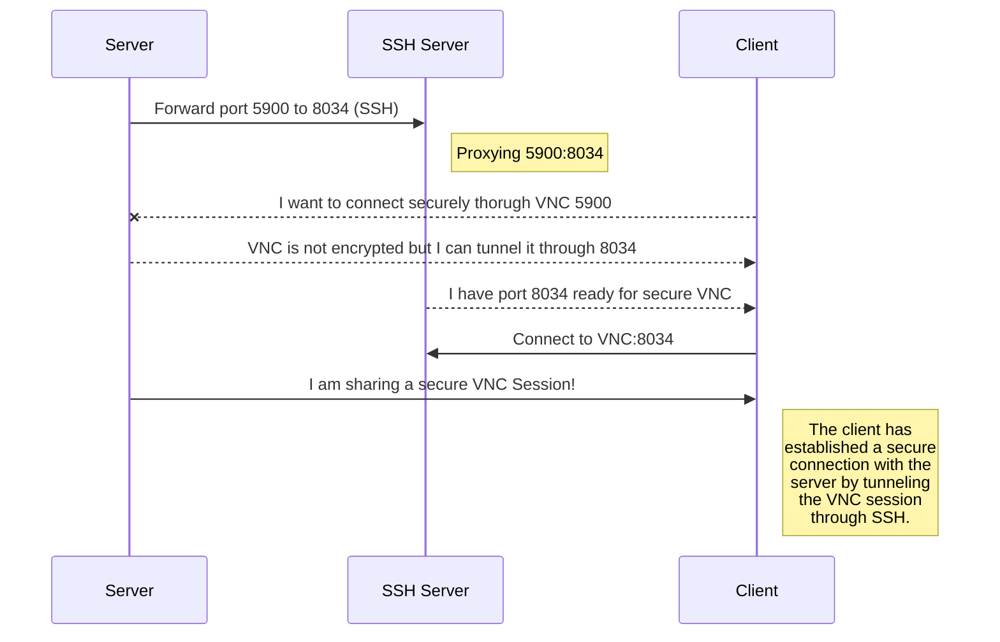

#  SSH Tunnel Manager 

Tunnel Manager is a tool for **proxying, pivoting and securing connections over SSH.**
It's basically a GUI wrapper for **plink** but adds **profiling, notifications** and is focused on **automation** and **session persistence**.
It is written mainly in **[AutoHotkey](https://www.autohotkey.com/)** and the GUI framework that I used is [Neutron.ahk](https://github.com/G33kDude/Neutron.ahk), so it has a little bit of HTML, CSS (Bootstrap 3), JS and JQuery.
> **Personal note:** I use it every day and I've found tunnels to be a key of success at sharing resources with others no matter the place, device or network, and thanks to SSH it's simple and secure.

## Compiled Version & Downloads
Go check **[releases](https://github.com/elModo7/Tunnel_Manager/releases)** for compiled binaries if you don't want to have AutoHotkey installed.
You can also **download from this document.**
|Version| Download |
|--|--|
| `Latest` | [`Download Link`](sample)  |
| 1.2.29 | [Download Link](sample)  |

## Features

- Support Local, Remote and Dynamic SSH Tunneling
- Server and Tunnel Profiling
- Neutron Web UI
- Console Output
- Auto Accept SSH Key
- Silent Mode with Profile Select / Silent/NoGUI (1.2.24+)
- Hide Tray icon option for Shadow Mode (1.2.16+)
- DRM Copy Protection included via Online Validation of Serial based on Hardware Fingerprint
- Temporary Tunnels without Saving
- Relaunch Tunnel on disconnect
- No need for a full reload on profile select
- Online version checker based on GitHub repo
- Allow enabling/disabling per proflie+tunnel configuration
- Keep track of last used profile (path)
- Config checks on repeated/incorrect tunnel configurations (Improved in 1.2.11+)
- DRM Two Way Encryption (1.2.10+)
- Quick Copy Tunnel (1.2.14+)
- QR Code Generator (1.2.17+) / Press Ctrl while the app is active and click on Copy Link Button
- Discord WebHook Notify / Telegram API Notify / PushBullet Notify (1.2.18+)
- Console Output Toggle (1.2.21+)
- Reload Tunnel While Running (1.2.23+) / Allows restarting the tunnel in case configuration changed and you are working remotely
- Quick Hide/Show by Double Clicking Tray Icon (1.2.23+)
- Increased Command Line Tools and Tray Actions (1.2.24+)
- Parameter info on cmd (chalk) or msgbox (1.2.24+)
- Added License (1.2.26+)
- Auto Update PLink Client to the latest version on first run (1.2.28+)
- Option to download latest PLink or use built in on first run or proxy deletion (1.2.29+)
- Fully Open Source (1.2.29+)
- Remove DRM Protection (No Serial Required) (1.2.29+)

#### PARAMS:
- -nogui (Disables GUI)
- -silent (Disables Tray Notifications)
- -notray (Removes Tray Icon)
- -hidden (Starts Hidden)
- -autostart (Starts Tunneling on Startup)
- -profile <profile_path>
## Sample Usage

#### TODO:
- TCP / Websocket Interop (Server)

#### REQUIERES:
- Windows 7 x64 (Windows 10+ Recommended)
- AutoHotkey U64 1.1.31+

#### DROPPED / DISCARDED:
- Keep Serial active for 7 days before asking again (DRM Security Risk)
- Change order of each individual Tunnel
- IRC Notify
- IRC Control Plugin
- Telegram API Control Plugin

#### BUGFIXES:
- Too Many Hotkeys Triggered (1.2.22)
- Profile Param had to be last param or else it wouldn't load (1.2.28)

Icon by [Hotpot.ai](https://hotpot.ai/)